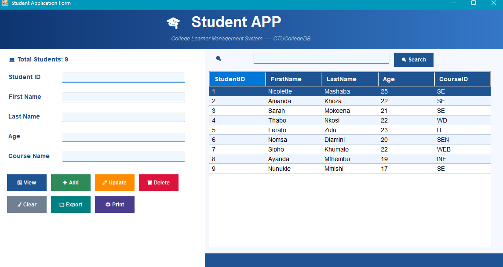
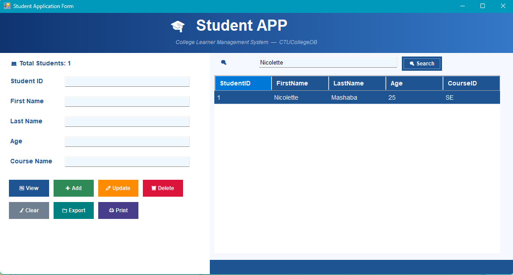
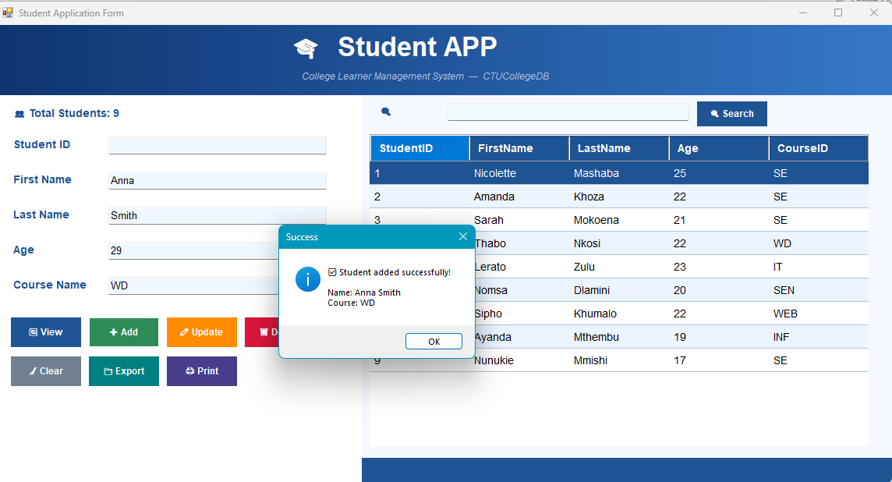
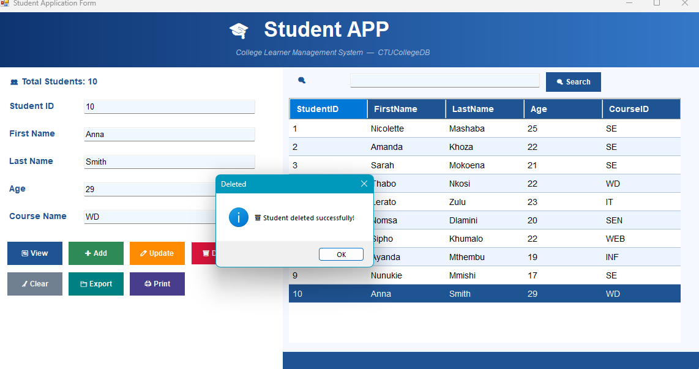

# ?? CollegeLMS — College Learner Management System


> A polished Windows Forms student management application built for CTU College class activities.  
> Demonstrates real-world CRUD operations, ADO.NET database connectivity, and modern UI design patterns.

---

## ?? Screenshots

> _Add screenshots of your running app here_

| Main Screen | Search Feature |
|---|---|
|  |  |

| Add Student | Delete Confirmation |
|---|---|
|  |  |

> ?? To add screenshots: create a `/screenshots` folder in your repo and drag your images in.

---

## ? Features

| Feature | Description |
|---|---|
| ?? **View Students** | Load and display all students from SQL Server in a styled DataGridView |
| ? **Add Student** | Insert new student records with validation |
| ?? **Update Student** | Edit existing student details with confirmation dialog |
| ??? **Delete Student** | Remove student records with name confirmation |
| ?? **Search** | Filter by name, student ID, or course in real time |
| ?? **Export to CSV** | Save current student list as a timestamped CSV file |
| ??? **Print Preview** | Print a styled student roster with headers and alternating rows |
| ?? **Clear Fields** | Reset all input fields instantly |
| ?? **Student Count** | Live count of total students displayed |
| ?? **Modern UI** | Gradient header, rounded buttons, hover effects, alternating rows |
| ?? **Status Bar** | Real-time feedback on every action |

---

## ??? Technologies Used

| Technology | Purpose |
|---|---|
| **C# (.NET Framework)** | Main programming language |
| **Windows Forms** | Desktop UI framework |
| **ADO.NET** | Database connectivity (SqlConnection, SqlCommand, SqlDataAdapter) |
| **SQL Server Express (SSMS)** | Local relational database |
| **System.Drawing** | Custom UI painting (gradient, rounded buttons) |
| **System.Drawing.Printing** | Print preview and document generation |
| **System.IO** | CSV file export |
| **Git & GitHub** | Version control and code hosting |

---

## ??? Database Setup

### Step 1 — Open SSMS and connect to your server

### Step 2 — Run this SQL to create the database and table:

```sql
-- Create database
CREATE DATABASE CTUCollegeDB;
GO

USE CTUCollegeDB;
GO

-- Create Student table
CREATE TABLE Student (
    StudentID  INT PRIMARY KEY IDENTITY(1,1),
    FirstName  VARCHAR(100) NOT NULL,
    LastName   VARCHAR(100) NOT NULL,
    Age        INT,
    CourseID   VARCHAR(50)
);
GO

-- Insert sample data
INSERT INTO Student (FirstName, LastName, Age, CourseID) VALUES
('Nicolette', 'Mashaba', 25, 'SE'),
('Amanda',    'Khoza',   22, 'SE'),
('Sarah',     'Mokoena', 21, 'SE'),
('Thabo',     'Nkosi',   22, 'WD'),
('Lerato',    'Zulu',    23, 'IT'),
('Nomsa',     'Dlamini', 20, 'SEN'),
('Sipho',     'Khumalo', 22, 'WEB'),
('Ayanda',    'Mthembu', 19, 'INF');
GO
```

### Step 3 — Verify your table exists:
```sql
USE CTUCollegeDB;
SELECT * FROM Student;
```

---

## ?? How to Install & Run

### Prerequisites
- Visual Studio 2022
- .NET Framework 4.7.2 or higher
- SQL Server Express (SSMS)
- Git

### Step 1 — Clone the repository
```bash
git clone https://github.com/NickiMash17/CollegeLMS.git
cd CollegeLMS
```

### Step 2 — Open in Visual Studio
```
File ? Open ? Project/Solution ? CollegeLMS.sln
```

### Step 3 — Update the connection string (if needed)
In `Form1.cs`, find this line and update your server name:
```csharp
string connectionString =
    "Server=YOUR_SERVER_NAME\\SQLEXPRESS;Database=CTUCollegeDB;Trusted_Connection=True;Encrypt=False;TrustServerCertificate=True;";
```
> ?? To find your server name: open SSMS ? look at the "Server name" field on the connect screen

### Step 4 — Build and Run
```
Press F5  OR  Click the green ? Start button
```

---

## ?? How to Use

| Action | Steps |
|---|---|
| **View all students** | Click the ?? View button |
| **Add a student** | Fill in First Name, Last Name, Age, Course ? Click ? Add |
| **Update a student** | Click a row ? edit the fields ? Click ?? Update |
| **Delete a student** | Click a row ? Click ??? Delete ? Confirm |
| **Search** | Type in the search box ? Click ?? Search |
| **Export to CSV** | Click ?? Export ? Choose save location |
| **Print** | Click ??? Print ? Preview opens ? Print |
| **Clear fields** | Click ?? Clear |

---

## ?? Project Structure

```
CollegeLMS/
??? Form1.cs              ? Main logic (CRUD, search, export, print)
??? Form1.Designer.cs     ? UI layout and control definitions
??? Form1.resx            ? Resources
??? Program.cs            ? App entry point
??? CollegeLMS.csproj     ? Project file
??? screenshots/          ? Add your screenshots here
??? README.md             ? This file
```

---

## ?? Security Notes

> ?? The connection string in this project uses Windows Authentication (Integrated Security).  
> For production applications, never hardcode connection strings — use environment variables or a config file that is added to `.gitignore`.

---

## ?? Project Metadata

| Field | Details |
|---|---|
| **Author** | Nicolette Mashaba |
| **GitHub** | [@NickiMash17](https://github.com/NickiMash17) |
| **Student No.** | 20232990 |
| **Module** | KM-03: Database Manipulation and C# |
| **Class Activity** | Week 3 Practical |
| **Institution** | CTU Training Solutions |
| **Date Created** | 12 March 2026 |

---

## ?? License

```
All rights reserved © 2026 Nicolette Mashaba
For classroom and learning purposes only.
Not for commercial use.


```

---

<div align="center">
  <p>Built with ?? by <a href="https://github.com/NickiMash17">NickiMash17</a> for CTU Training Solutions</p>
  <p>? Star this repo if it helped you!</p>
</div>